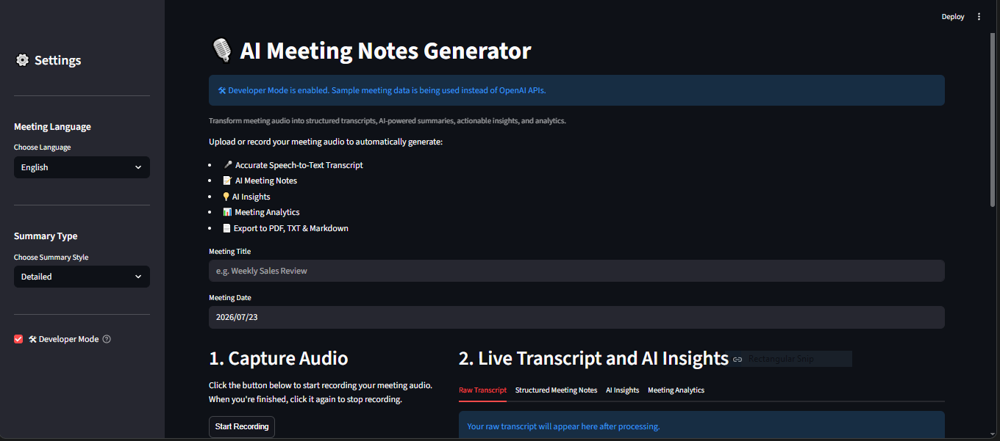
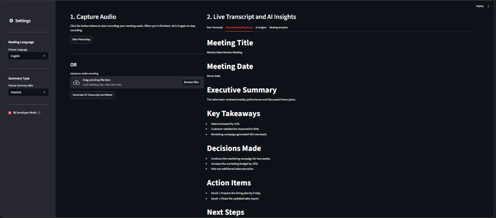
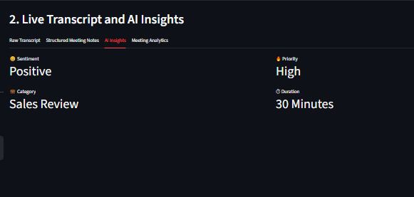
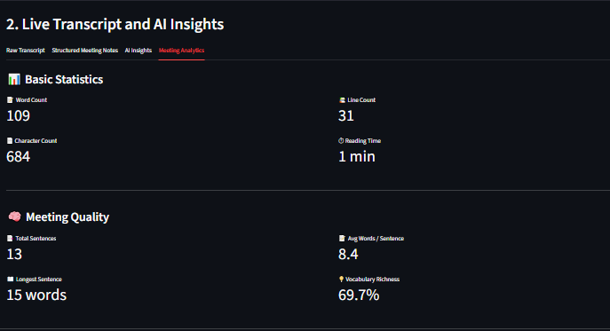

# 🎙️ AI Meeting Notes Generator

Transform meeting audio into structured transcripts, AI-powered meeting notes, actionable insights, analytics, and downloadable reports using OpenAI Whisper and GPT.

---

## 🚀 Features

- 🎤 Record meeting audio directly
- 📂 Upload WAV, MP3, or M4A audio
- 📝 AI Speech-to-Text Transcription
- 📋 Professional Meeting Notes
- 💡 AI Meeting Insights
- 📊 Meeting Analytics Dashboard
- 📄 Export to PDF
- 📑 Download Transcript (.txt)
- 📝 Download Notes (.md)
- 🎯 Developer Mode (Run without OpenAI API)

---

## 📸 Screenshots

> Screenshots will be added here.

### Home Page



### AI Meeting Notes



### AI Insights



### Meeting Analytics



---

## 🛠 Tech Stack

| Category | Technology |
|----------|------------|
| Language | Python |
| Framework | Streamlit |
| AI | OpenAI GPT-4o Mini |
| Speech Recognition | Whisper |
| PDF | ReportLab |
| Image | Pillow |
| Environment | Python Dotenv |

---

## 📂 Project Structure

```text
AI-Meeting-Notes-Generator
│
├── assets/
├── temp/
├── utils/
│   ├── analytics.py
│   ├── config.py
│   ├── error_handler.py
│   ├── file_handler.py
│   ├── insights.py
│   ├── pdf_export.py
│   ├── prompts.py
│   ├── sample_data.py
│   ├── session.py
│   ├── summarizer.py
│   ├── transcription.py
│   └── ui.py
│
├── app.py
├── requirements.txt
├── .env.example
└── README.md
```

---

## ⚙ Installation

Clone the repository

```bash
git clone https://github.com/Vipin-Andel/AI-Meeting-Notes-Generator.git
```

Move into the project

```bash
cd AI-Meeting-Notes-Generator
```

Install dependencies

```bash
pip install -r requirements.txt
```

Create a `.env` file

```env
OPENAI_API_KEY=your_api_key_here
```

Run the application

```bash
streamlit run app.py
```

---

## 🎯 Workflow

1. Record or upload meeting audio
2. Generate transcript
3. Create AI meeting notes
4. View AI insights
5. Analyze meeting statistics
6. Export PDF or download transcript

---

## 📊 Analytics Included

- Word Count
- Character Count
- Reading Time
- Sentence Count
- Average Words per Sentence
- Longest Sentence
- Vocabulary Richness

---

## 📄 Export Options

- PDF Report
- Markdown Notes
- TXT Transcript
- Raw Audio Recording

---

## 🔮 Future Improvements

- Multi-language Translation
- Speaker Identification
- AI Action Item Tracker
- Calendar Integration
- Email Meeting Notes
- Cloud Storage Support
- Meeting Search
- Team Dashboard

---

## 👨‍💻 Author

**Vipin Andel**

GitHub:
https://github.com/Vipin-Andel

---

## ⭐ Support

If you found this project useful, consider giving it a ⭐ on GitHub.

---
